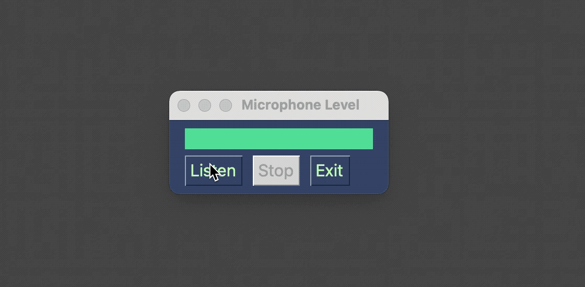

## Integrating  PySimpleGUI & PyAudio

This is the companion repo for a Medium tutorial post on integrating PyAudio and PySimpleGUI.

For a step by step that covers things like a simple PyAudio Blocking and non blocking microphone example consult the post:

<a href="https://k3no.medium.com/integrating-pyaudio-pysimplegui-5fa342b1e113" target="_blank">Integrating PyAudio & PySimpleGUI</a>

This repo is just the gists used in repo form, the final script  if you just want to copy/pasta or check it out is  [Microphone_listener.py](https://github.com/KenoLeon/PySimpleGUI-PyAudio/blob/main/Microphone_listener.py) 

Cheers !
